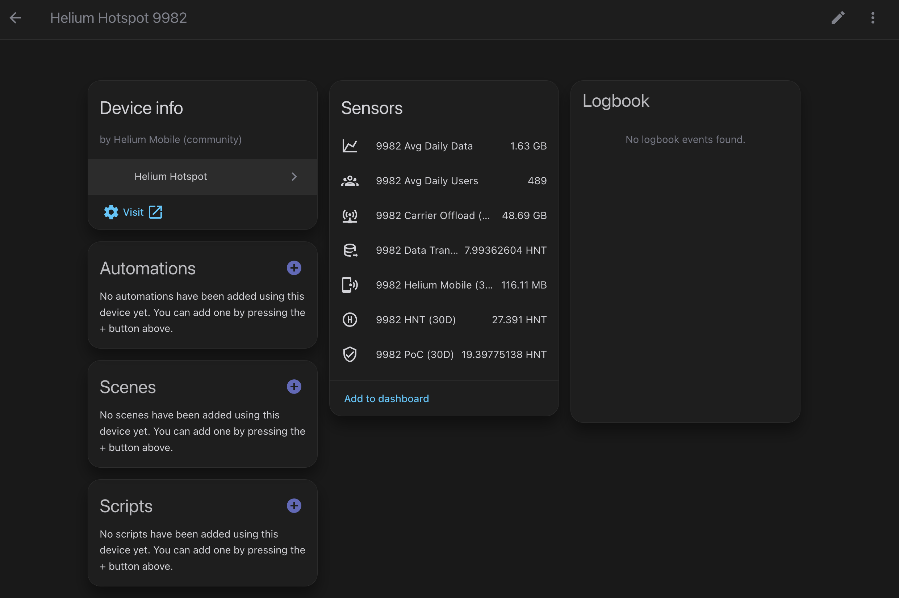

# Helium Hotspot – Home Assistant Custom Integration

[](https://hacs.xyz/)
[](https://github.com/youruser/helium_hotspot/releases)

Custom integration for [Home Assistant](https://www.home-assistant.io) that fetches stats from [world.helium.com](https://world.helium.com) for Helium Mobile hotspots.

---

## ✨ Features

- 🛰️ Tracks **Helium Mobile hotspots** by hotspot number (e.g. `9982`).
- 📊 Exposes sensors for:
  - HNT Earned (30D total)
  - Proof of Coverage (30D HNT)
  - Data Transfer (30D HNT)
  - Carrier Offload (30D data amount)
  - Helium Mobile (30D data amount)
  - Average Daily Data
  - Average Daily Users
- 🏷️ Displays the hotspot’s **friendly name** and **location**.
- 🔄 Configurable **update interval** (default: 1 hour).
- 🧩 Supports multiple hotspots (comma-separated list).

---

## 📥 Installation

### HACS (Recommended)
1. Go to HACS → Integrations → menu (⋮) → **Custom repositories**.
2. Add this repo URL, select type = Integration.
3. Search for **Helium Hotspot** in HACS and install.
4. Restart Home Assistant.

### Manual
1. Copy the folder `custom_components/helium_hotspot` into your Home Assistant `config/custom_components/`.
2. Restart Home Assistant.

---

## ⚙️ Configuration

1. In Home Assistant, go to **Settings → Devices & Services → + Add Integration**.
2. Search for **Helium Hotspot**.
3. Enter one or more hotspot numbers (comma separated, e.g. `9982,123456`). This can be found in the Helium app or on [world.helium.com](https://world.helium.com) (e.g. `9982` in `world.helium.com/en/network/mobile/hotspot/9982` when viewing the hotspot details).
4. Done ✅

### Options
- **Update interval (minutes)**: how often to refresh data (default: 60, min: 5).

---

## 📡 Entities

Each hotspot device exposes:

| Sensor Key              | Name                  | Unit | Icon                             |
|--------------------------|-----------------------|------|----------------------------------|
| `tokens_earned_30d_hnt` | HNT (30D total)      | HNT  | `mdi:alpha-h-circle-outline`     |
| `proof_of_coverage_30d` | PoC (30D)            | HNT  | `mdi:shield-check-outline`       |
| `data_transfer_30d`     | Data Transfer (30D)  | HNT  | `mdi:database-arrow-right-outline` |
| `carrier_offload`       | Carrier Offload (30D)| —    | `mdi:access-point-network`       |
| `helium_mobile`         | Helium Mobile (30D)  | —    | `mdi:cellphone-wireless`         |
| `avg_daily_data`        | Avg Daily Data       | —    | `mdi:chart-line`                 |
| `avg_daily_users`       | Avg Daily Users      | —    | `mdi:account-group-outline`      |

Extra attributes on the **HNT sensor**:
- `hnt_source` (`sum` or `display`)
- `proof_of_coverage_30d`
- `data_transfer_30d`
- `hotspot_name`
- `hotspot_location`

---

## 🖼️ Example

Device: **Raspy Cedar Parakeet**  
Location: **Houston, Texas, United States**



---

## Known Issues and Todos
- [ ] KOWN ISSUES:
  - Auto refresh of entity sensors does not work, need to reload integration or restart Home Assistant to see updated values.
  - Hotspot name and location do not show up (API issue?).
- [ ] Add more sensors (e.g. total HNT, rewards by type).
- [ ] Add options flow for changing hotspot numbers and update interval after setup.
- [ ] Improve error handling and user feedback (e.g. invalid hotspot number).
- [ ] Add unit tests.
- [ ] Add support for Unit conversion (e.g. bytes to MB/GB).
- [ ] Figure out way to get more granular 24 hour data (e.g. daily HNT earned, not just 30 day).
- [ ] Add support for Helium IoT hotspots (not just Mobile) using the same webscraping technique just different URL base.


## 🛠️ Troubleshooting

- If sensors don’t appear, enable debug logging:
  ```yaml
  logger:
    default: warning
    logs:
      custom_components.helium_hotspot: debug
